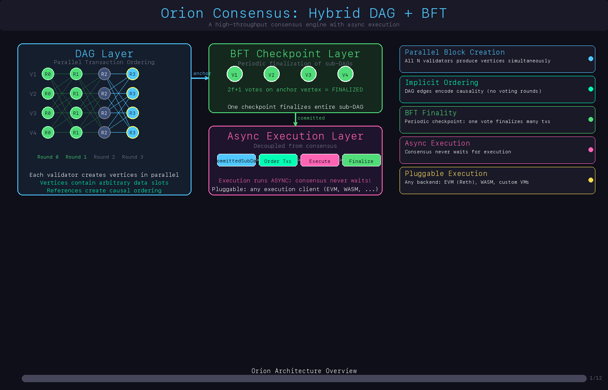

<p align="center">
  
</p>

<p align="center">
  
</p>

Orion is a hybrid consensus engine combining **DAG-based fast ordering** with **BFT checkpoint finalization**. It separates transaction ordering (consensus) from execution, providing low-latency ordering guarantees while maintaining strong finality through periodic BFT checkpoints.

## Architecture Overview

The system consists of three main components that run in a *pipeline*:

1. **DAG Ordering Layer** – fast, asynchronous consensus that orders transactions into committed sub-dags
2. **BFT Checkpoint Layer** – periodically finalizes the *prefix* of the ordered sequence via two-phase BFT
3. **Execution Layer** – a state machine that consumes committed sub-dags and executes transactions **asynchronously** from BFT

## Key Improvements Over Traditional BFT

### Traditional BFT 
```
Consensus → Execute → Finalize
     ↓         ↓         ↓
   Fast    Slow (blocks)  Fast
```
**Problem**: Consensus must wait for execution, making consensus slow.

### This Hybrid System
```
DAG Order → BFT Finalize → Execute
    ↓            ↓            ↓
  Fast         Fast      Slow (doesn't block)
```
**Advantage**: 
- Consensus (DAG + BFT) is fast and doesn't wait for execution
- Execution can be slow/parallel without affecting consensus latency
- Ordering finality is independent of execution time
- Execution happens on already-finalized, immutable order

**Traditional BFT**: Execution is part of consensus → Consensus waits for execution → **Slow**

**Hybrid System**:
- **DAG orders transactions** (fast, does not wait for execution)
- **BFT finalizes checkpoints on the ordered prefix** (does not wait for execution)
- **Execution consumes committed sub-dags as soon as they are ordered**, in parallel with checkpointing

## Key Properties

### 1. **Ordering Guarantees**
- **Consensus determines order**: DAG consensus establishes the canonical transaction order
- **Order is immutable**: Once committed, the order cannot change
- **Order is deterministic**: All nodes agree on the same order
- **Order is independent**: Execution results don't affect consensus order

### 2. **Execution Guarantees**
- **Execution follows DAG-committed order**: The execution engine consumes committed sub-dags in order of their height.
- **State is deterministic**: Given the same ordered transactions, all nodes compute the same state roots.
- **Execution is asynchronous**: State transitions run in the background and do not block DAG or BFT progress.
- **Execution can lag**: Slow or heavy workloads do not increase consensus latency; they only affect how quickly state catches up.

### 3. **Finality Guarantees**
- **Fast ordering finality**: DAG commits immediately fix the relative order of transactions.
- **Strong checkpoint finality**: BFT checkpoints provide cryptographic finality on prefixes of the ordered sequence.
- **Periodic finalization**: Checkpoints are formed at configurable height intervals.
- **Order-before-execution**: Execution is always driven by the canonical DAG order; checkpoints make large prefixes of that order immutable.

## Detailed Message Flow Sequence

- **1. Client → DAG (Ordering)**
  - The application submits transactions to an Orion node.
  - The `DagOrdering` layer groups transactions into blocks, signs them, and broadcasts them over the network.

- **2. DAG orders and commits a sub-dag**
  - Nodes collect blocks from other validators.
  - Once a round has a quorum (≥ 2f+1 blocks), the DAG layer commits a **sub-dag** at height *h*, fixing the order of all transactions in that sub-dag.

- **3. Execution starts immediately (async lane)**
  - As soon as a sub-dag is committed, the node pushes it to the `ExecutionEngine`.
  - The execution engine immediately executes all transactions in that sub-dag in order, producing a new state root and an `ExecutedBlock { height, dag_id, state_root, transactions }`.
  - Execution runs in its own async task and can lag behind consensus without affecting DAG or BFT progress.

- **4. BFT checkpoints run in parallel (for finality only)**
  - The `BftCheckpointEngine` observes committed sub-dag heights.
  - At configurable intervals (e.g., every *K* committed heights), it derives a **checkpoint candidate** for height *H* over the ordered sequence.
  - Validators run a two-phase BFT protocol (PREPARE / COMMIT) on the candidate to form quorum certificates.
  - Once a Commit QC is formed, the checkpoint at height *H* is **finalized**: all ordered transactions up to height *H* are immutable. Execution does **not** wait for this; checkpoints are purely for strong finality.

- **5. Reading finalized state**
  - Clients can treat any executed block at or below the latest finalized checkpoint height as final.
  - State queries read from the execution engine (which has applied committed sub-dags in order), while BFT checkpoints provide a clear notion of “irreversible” history.

## Sequence Diagram (Intuition)

```text
Client           DAG                 Execution              BFT Checkpoint
  |              |                       |                        |
  |-- submit TX ->                       |                        |
  |              |-- create/broadcast -->|                        |
  |              |        blocks         |                        |
  |              |                       |                        |
  |              |-- commit sub-dag h -->|-- execute sub-dag h -->|
  |              |                       |   (async, immediately) |
  |              |                       |                        |
  |              |-- heights ------------+----------------------->|
  |              |                       |   derive candidate H   |
  |              |                       |<-- PREPARE / COMMIT -->|
  |              |                       |   finalize prefix ≤ H  |
  |              |                       |                        |
  |<-- query state / finality ---------- | <--------------------- |
```

## Application Integration & Examples

For end-to-end usage of the Orion consensus engine in your own application (submitting transactions, subscribing to commits, querying executed state, and wiring a full node), see:

- `examples/README.md` – high-level integration guide
- `examples/app_connection.rs` – runnable sample application

## Network Layer: Raptorcast Support

The system supports **Raptorcast** for efficient network broadcasting. Raptorcast uses Raptor codes for reliable, efficient message broadcasting with erasure coding, making it ideal for consensus protocols.

### Using Raptorcast

To enable Raptorcast support, build with the `raptorcast` feature:

```bash
cargo build --release --features raptorcast
```

The system provides two network implementations:

1. **InMemoryDataPlane** (default): Simple in-memory channels for testing
2. **RaptorcastDataPlane** (with `raptorcast` feature): Production-ready network layer using Raptorcast

### Benefits of Raptorcast

- **Efficient broadcasting**: Uses Raptor codes for erasure coding
- **Reliable delivery**: Handles packet loss gracefully
- **Low overhead**: Optimized for consensus message broadcasting
- **Scalable**: Works well with large validator sets

## Running

```bash
# Build
cargo build --release

# Run a node (binary name: orion-node)
cargo run --bin orion-node -- \
    --authority 0 \
    --committee-size 4 \
    --checkpoint-interval 10

# Run the application connection example
cargo run --example app_connection

# Run tests
cargo test

# Run ordering guarantee tests
cargo test --test ordering_guarantees
```

## Testing

Run all tests:
```bash
cargo test
```
